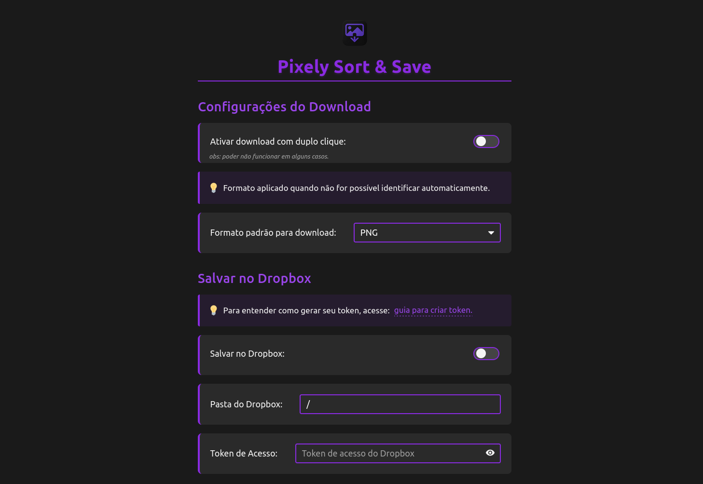
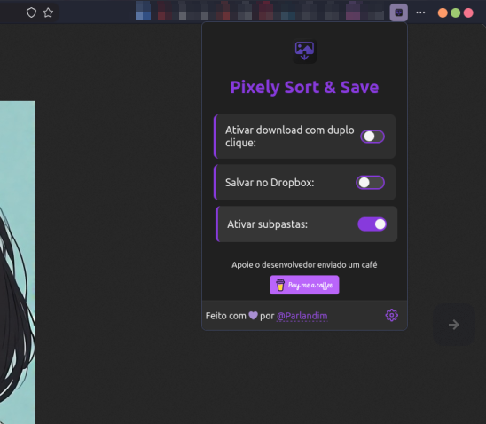
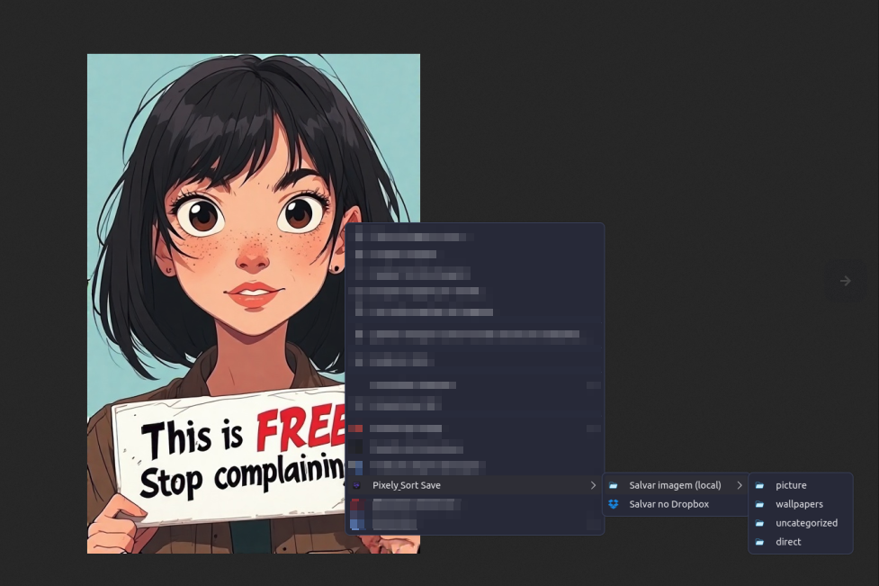

# Pixely Sort & Save

[](https://addons.mozilla.org/en-US/firefox/addon/pixely-sort-save/)

Salve imagens da web de forma rápida, organizada e sem complicações.
**Pixely Sort & Save** adiciona um botão no menu de contexto que permite salvar qualquer imagem diretamente em uma pasta específica, usando sufixos para organizar suas coleções. O nome do arquivo é gerado automaticamente, evitando janelas de diálogo e acelerando seu fluxo de trabalho.

---

## 🎞️ Funcionalidades

* ✅ Salvar imagens com apenas um clique (menu de contexto)
* ✅ Salvar com duplo clique do mouse
* ✅ Defina sufixos personalizados para organizar em subpastas
* ✅ Nome aleatório automático com extensão preservada
* ✅ Sem janelas de diálogo de download
* ✅ Salvar diretamente no Dropbox
* 🔜 Salvar no Google Drive (em breve)
* ✅ Leve, rápido e fácil de usar


---

## 🚀 Instalação Manual

1. Baixe este repositório como ZIP e extraia os arquivos, ou clone:

   ```bash
   git clone https://github.com/seu-usuario/pixely-sort-save.git
   ```
2. No Firefox/Chrome, acesse:

   * `about:debugging` (Firefox) → "Carregar Add-on Temporário"
   * `chrome://extensions` (Chrome) → Ative "Modo de desenvolvedor" → "Carregar sem compactação"
3. Selecione a pasta do projeto.

---

## 📦 Criação dos Arquivos da Extensão
A extensão inclui scripts para facilitar a geração dos arquivos de distribuição:

Para Firefox:

Execute o script `compactar_extensao.sh` para gerar o arquivo `.xpi`:

```bash
./compactar_extensao.sh
```
Este script:

* Cria um diretório `dist_firefox`
* Gera o arquivo `.xpi` compatível com Firefox
* Utiliza o `manifest.firefox.json` como base

Para Chrome:

Execute o script `gerar_pasta_chrome.sh` para preparar os arquivos:

```bash
./gerar_pasta_chrome.sh
```

Este script:

* Cria um diretório `dist_chrome` com todos os arquivos necessários
* Utiliza o` manifest.chrome.json` como base
* Organiza a estrutura de arquivos conforme exigido pelo Chrome


---

## ⚙️ Configurações

### Página de Configurações

* Acesse a página de configurações da extensão.
* Adicione ou edite os sufixos que serão usados para criar subpastas.
* As imagens serão salvas em `/images/<sufixo>/`.




### Menu Rápido na Toolbar
A extensão oferece um menu rápido na barra de ferramentas para acesso às funções mais comuns:

* Ative/desative recursos rapidamente
* Acesse as configurações com um clique
* Visualize o status das integrações (Dropbox/Google Drive)


---

## 🗂️ Estrutura dos Arquivos Salvos

```
/images/
 ├── wallpapers/
 ├── memes/
 ├── referencias/
 └── screenshots/
```

---

## 💡 Como Usar

1. Clique com o botão direito sobre qualquer imagem na web.
2. Selecione **"Pixely Sort & Save"**.
3. Escolha um dos sufixos configurados.
4. A imagem será salva automaticamente em `/images/<sufixo>/` com um nome aleatório.



---

## 🌐 Compatibilidade

* Firefox
  * Outros navegadores  baseado no Firefox
  * Zen (testado)
  * Waterfox
  * LibreWolf
* Chrome
  * Outros navegadores baseado no chrome
  * Chrome (testado)
  * Brave
  * Opera
  * Vivaldi
